# Azure Estate Map

**Run ID:** MAP-20260513-prod-89ac0d4e
**Scope:** prod
**Generated (UTC):** 2026-05-13T05:32:59Z
**Ruleset hash:** 89ac0d4e

## Summary

| Metric | Value |
|---|---|
| Subscriptions in scope | 1 |
| Resource groups | 6 |
| Resources | 57 |
| Relationship edges | 0 |
| High-risk resources | 0 |

## Estate Diagram

> Rendered by VS Code Mermaid preview. If the diagram is blank, open this file in VS Code
> and install the Markdown Preview Mermaid Support extension.

```mermaid
flowchart TD
    classDef highRisk fill:#ff4444,color:#fff,stroke:#cc0000;

    n_fbb44fc8["🔵 sub-id\nsub-id"]
    n_fbb44fc8 --> n_70f32abd["📁 aks01day2-rg"]
    n_70f32abd --> n_4b795ff6["prometheusrulegroups/KubernetesRecordingRulesRuleGroup-aks01day2"]
    n_70f32abd --> n_3bf2c7e8["prometheusrulegroups/NodeAndKubernetesRecordingRulesRuleGroup-Win-aks01day2"]
    n_70f32abd --> n_45ffacf0["prometheusrulegroups/NodeRecordingRulesRuleGroup-aks01day2"]
    n_70f32abd --> n_f77ccbc5["prometheusrulegroups/NodeRecordingRulesRuleGroup-Win-aks01day2"]
    n_70f32abd --> n_16bab2ab["prometheusrulegroups/UXRecordingRulesRuleGroup - aks01day2"]
    n_70f32abd --> n_48caf7a6["prometheusrulegroups/UXRecordingRulesRuleGroup-Win - aks01day2"]
    n_70f32abd --> n_6648bdf3["containerapps/databricks-mcp"]
    n_70f32abd --> n_c1ec827f["managedenvironments/databricks-mcp-env"]
    n_70f32abd --> n_484d3595["registries/aks01day2acr"]
    n_70f32abd --> n_5fbb192a["managedclusters/aks01day2"]
    n_70f32abd --> n_e4b93606["dashboards/AKS-Triage-Dashboard"]
    n_70f32abd --> n_c5665404["dashboards/APIserver"]
    n_70f32abd --> n_0ceb2ef7["dashboards/APIserver-Etcd"]
    n_70f32abd --> n_98d3d5cd["dashboards/Dashboard-10-02-2025-19-55"]
    n_70f32abd --> n_412d283a["dashboards/Dashboard-10-02-2025-19-57"]
    n_70f32abd --> n_ab1a386f["dashboards/New-FlowLogs"]
    n_70f32abd --> n_6f021af9["dashboards/New-FlowLogs-ExtTraffic"]
    n_70f32abd --> n_ee01cf61["grafana/grafana-aks01day2lawCUS"]
    n_70f32abd --> n_64adea42["actiongroups/RecommendedAlertRules-AG-1"]
    n_70f32abd --> n_c7c21565["components/aks01day2"]
    n_70f32abd --> n_0222be46["datacollectionendpoints/MSCI-ingest-centralus-aks01day2"]
    n_70f32abd --> n_2bfa1fa9["datacollectionendpoints/MSProm-centralus-aks01day2"]
    n_70f32abd --> n_1457aef3["datacollectionrules/MSCI-centralus-aks01day2"]
    n_70f32abd --> n_24922171["datacollectionrules/MSProm-centralus-aks01day2"]
    n_70f32abd --> n_dffacc2a["webtests/hello-ai-health-test-aks01day2"]
    n_70f32abd --> n_f0906e5f["workbooks/aecb6615-ef10-4731-8a69-91fe52aaf092"]
    n_70f32abd --> n_0cff63b4["userassignedidentities/aks-mcp-identity"]
    n_70f32abd --> n_f0c5dfcb["userassignedidentities/databricks-mcp-identity"]
    n_70f32abd --> n_cd5d37e5["accounts/aks01day2workspaceCUS"]
    n_70f32abd --> n_fe827f73["workspaces/workspace-aks01day2rgH7rN"]
    n_70f32abd --> n_74df17c3["dashboards/0a3ce29e-669a-4a4e-9ba0-21c83041066d-dashboard"]
    n_fbb44fc8 --> n_664af129["📁 aks02day2-rg"]
    n_664af129 --> n_89e03ae3["prometheusrulegroups/KubernetesRecordingRulesRuleGroup - aks02day2"]
    n_664af129 --> n_13706a90["prometheusrulegroups/NodeAndKubernetesRecordingRulesRuleGroup-Win - aks02day2"]
    n_664af129 --> n_767d7032["prometheusrulegroups/NodeRecordingRulesRuleGroup - aks02day2"]
    n_664af129 --> n_5a1abf1a["prometheusrulegroups/NodeRecordingRulesRuleGroup-Win - aks02day2"]
    n_664af129 --> n_21b11fd9["prometheusrulegroups/UXRecordingRulesRuleGroup - aks02day2"]
    n_664af129 --> n_787d2347["prometheusrulegroups/UXRecordingRulesRuleGroup-Win - aks02day2"]
    n_664af129 --> n_ee7c9412["managedclusters/aks02day2"]
    n_664af129 --> n_9c907fdc["datacollectionendpoints/MSProm-centralus-aks02day2"]
    n_664af129 --> n_7b3f22d0["datacollectionrules/MSCI-eastus2-aks02day2"]
    n_664af129 --> n_bbfd16bd["datacollectionrules/MSProm-centralus-aks02day2"]
    n_664af129 --> n_d9982cea["workspaces/aks02day2law"]
    n_fbb44fc8 --> n_9f0fda6e["📁 aksnapday2-rg"]
    n_9f0fda6e --> n_997524a0["managedclusters/aksnapday2"]
    n_fbb44fc8 --> n_f932ae9d["📁 apicenter-rg"]
    n_f932ae9d --> n_5bbefc1b["services/azureapicenter01"]
    n_fbb44fc8 --> n_1aec0362["📁 apptesting-rg"]
    n_1aec0362 --> n_730dfc86["components/aasdfasdfasdfasdfasdfasd"]
    n_1aec0362 --> n_f78b54a0["components/asdfasdfjv"]
    n_1aec0362 --> n_a304e13e["components/premasdfasdjv"]
    n_1aec0362 --> n_134a6c12["components/stdasdfasdjv"]
    n_1aec0362 --> n_3dd66faa["loadtests/loadtestingjv01"]
    n_fbb44fc8 --> n_c31ac97b["📁 az-foundry-rg"]
    n_c31ac97b --> n_429c691a["smartdetectoralertrules/Failure Anomalies - jv-eastus2-proj-resource-appinsights"]
    n_c31ac97b --> n_a1f813e8["botservices/enterprise-knowledge-agent60450"]
    n_c31ac97b --> n_6685d8ea["accounts/jv-eastus2-proj-resource"]
    n_c31ac97b --> n_9a8168d1["projects/jv-eastus2-proj-resource/jv-eastus2-proj"]
    n_c31ac97b --> n_af677fea["systemtopics/jvazurefoundrystorage-96c05769-f5e7-4977-976f-cb50f96b2735"]
    n_c31ac97b --> n_06d28c34["components/jv-eastus2-proj-resource-appinsights"]
    n_c31ac97b --> n_2099fdd6["workspaces/jv-eastus2-proj-resource-logs"]
    n_c31ac97b --> n_90ee5b89["storageaccounts/jvazurefoundrystorage"]

    %% Relationships
```

## High-Risk Overlay

| Subscription | Resource Group | Resource Name | Type | Risk Reason |
|---|---|---|---|---|
| _(none)_ | | | | |

## Relationships

| Type | Source ID | Target ID |
|---|---|---|
| _(none)_ | | |

---
*Run `@estate-cartographer drilldown <resource-id>` for relationship detail on a specific resource.*
