# Simulated test run — POC-8 Estate Cartographer

> ⚠️ Simulated outcome. Live validation occurs in VS Code with the ARM MCP server attached.
> Generated by builder-poc-8 on 2026-05-12.
> run_id: MAP-20260512-prod-a1b2c3d4

---

# Azure Estate Map

**Run ID:** MAP-20260512-prod-a1b2c3d4
**Scope:** prod
**Generated (UTC):** 2026-05-12T05:19:47Z
**Ruleset hash:** a1b2c3d4

## Summary

| Metric | Value |
|---|---|
| Subscriptions in scope | 4 |
| Resource groups | 7 |
| Resources | 14 |
| Relationship edges | 5 |
| High-risk resources | 4 |

## Estate Diagram

> Rendered by VS Code Mermaid preview. If the diagram is blank, open this file in VS Code
> and install the Markdown Preview Mermaid Support extension.

```mermaid
flowchart TD
    classDef highRisk fill:#ff4444,color:#fff,stroke:#cc0000

    %% Subscription: alpha-prod (sub-id: <simulated-sub-a>)
    subA["🔵 alpha-prod\n<simulated-sub-a>"]

    subA --> rgA1["📁 alpha-networking-rg"]
    subA --> rgA2["📁 alpha-compute-rg"]

    rgA1 --> res_1a2b3c4d["🌐 nsg/alpha-nsg-01"]
    rgA1 --> res_5e6f7a8b["🌐 publicIPAddresses/alpha-pip-01:::highRisk"]
    rgA2 --> res_9c0d1e2f["💻 virtualMachines/alpha-vm-01"]
    rgA2 --> res_3a4b5c6d["💾 disks/alpha-osdisk-01:::highRisk"]

    %% NSG → Subnet relationship
    res_1a2b3c4d -->|NSG_PROTECTS_SUBNET| snet_7e8f9a0b["🔌 subnet/alpha-subnet-default"]

    %% Subscription: beta-prod (sub-id: <simulated-sub-b>)
    subB["🔵 beta-prod\n<simulated-sub-b>"]

    subB --> rgB1["📁 beta-app-rg"]
    subB --> rgB2["📁 beta-data-rg"]

    rgB1 --> res_b1c2d3e4["🌍 sites/beta-webapp-01"]
    rgB1 --> res_f5a6b7c8["🔑 vaults/beta-keyvault-01"]
    rgB2 --> res_d9e0f1a2["🗄️ storageaccounts/beta-storage-01"]

    %% MI → KV relationship
    res_b1c2d3e4 -->|MI_ACCESSES_KV| res_f5a6b7c8

    %% Subscription: gamma-shared (sub-id: <simulated-sub-c>)
    subC["🔵 gamma-shared\n<simulated-sub-c>"]

    subC --> rgC1["📁 gamma-infra-rg"]

    rgC1 --> res_3b4c5d6e["🌐 publicIPAddresses/gamma-pip-gw:::highRisk"]
    rgC1 --> res_7f8a9b0c["💾 disks/gamma-datadisk-01:::highRisk"]
    rgC1 --> res_1d2e3f4a["🌐 networksecuritygroups/gamma-nsg-fw"]

    %% NSG → Subnet relationship
    res_1d2e3f4a -->|NSG_PROTECTS_SUBNET| snet_5b6c7d8e["🔌 subnet/gamma-subnet-fw"]

    %% Subscription: delta-dev (sub-id: <simulated-sub-d>)
    subD["🔵 delta-dev\n<simulated-sub-d>"]

    subD --> rgD1["📁 delta-dev-rg"]

    rgD1 --> res_9e0f1a2b["💻 virtualMachines/delta-dev-vm-01"]
    rgD1 --> res_c3d4e5f6["🔑 vaults/delta-dev-kv-01"]

    %% MI → KV relationship
    res_9e0f1a2b -->|MI_ACCESSES_KV| res_c3d4e5f6
```

## High-Risk Overlay

| Subscription | Resource Group | Resource Name | Type | Risk Reason |
|---|---|---|---|---|
| alpha-prod (`<simulated-sub-a>`) | alpha-networking-rg | alpha-pip-01 | publicIPAddresses | Public IP assigned: `<simulated>203.0.113.10` |
| alpha-prod (`<simulated-sub-a>`) | alpha-compute-rg | alpha-osdisk-01 | disks | Encryption type: EncryptionAtRestWithPlatformKey — CMK not configured |
| gamma-shared (`<simulated-sub-c>`) | gamma-infra-rg | gamma-pip-gw | publicIPAddresses | Public IP assigned: `<simulated>203.0.113.55` |
| gamma-shared (`<simulated-sub-c>`) | gamma-infra-rg | gamma-datadisk-01 | disks | Encryption type: EncryptionAtRestWithPlatformKey — CMK not configured |

## Relationships

| Type | Source ID | Target ID |
|---|---|---|
| NSG_PROTECTS_SUBNET | `/subscriptions/<simulated-sub-a>/…/alpha-nsg-01` | `/subscriptions/<simulated-sub-a>/…/alpha-subnet-default` |
| NSG_PROTECTS_SUBNET | `/subscriptions/<simulated-sub-c>/…/gamma-nsg-fw` | `/subscriptions/<simulated-sub-c>/…/gamma-subnet-fw` |
| MI_ACCESSES_KV | `/subscriptions/<simulated-sub-b>/…/beta-webapp-01` | `/subscriptions/<simulated-sub-b>/…/beta-keyvault-01` |
| MI_ACCESSES_KV | `/subscriptions/<simulated-sub-d>/…/delta-dev-vm-01` | `/subscriptions/<simulated-sub-d>/…/delta-dev-kv-01` |
| MI_ACCESSES_KV | `<simulated-mi-id>` | `/subscriptions/<simulated-sub-b>/…/beta-keyvault-01` |

---
*Run `@estate-cartographer drilldown <resource-id>` for relationship detail on a specific resource.*

---

## Simulation notes

- Rule execution order: R001 → R002 → R003 → R004 → R005 → R006 → R007.
- R003 used 2 `execute_query` paging calls (simulated ~1800 resources; second page used `$skipToken`).
- All other rules returned results in a single page.
- `max_subscriptions` cap: 10. Simulated run used 4 subscriptions — cap not reached.
- `mermaid_max_nodes` cap: 200. Simulated run used ~25 nodes — cap not reached.
- All rule statuses: `OK` (no errors or skips in simulated run).
- Output written to `exports/map-prod-latest.md` (simulated).
